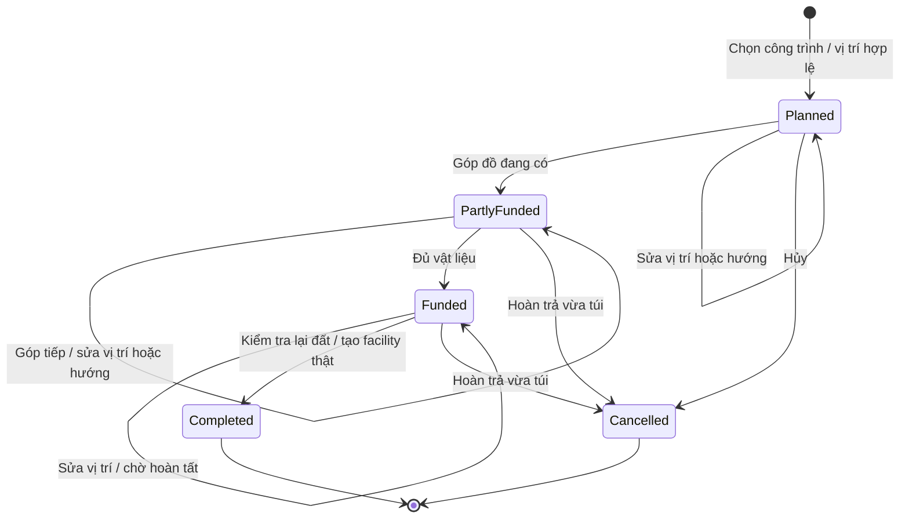

# Single Player Expedition — kế hoạch triển khai và hồ sơ bàn giao

Yêu cầu Owner ngày 02/10/2026. Nhánh: `product/single-player-expedition`. Mốc tách nhánh: main `638d51d690dc52c3944e04dc3b3c5beb618e6f0f`, sau PR #208. Tài liệu kỹ thuật đầy đủ, thứ tự thực hiện và sổ commit: [single-player-expedition-plan.md](single-player-expedition-plan.md).

## Mục tiêu nghiệp vụ

Người chơi solo có thể sống, khám phá và dựng tiền đồn bằng vật liệu thu thập được tại địa phương. Khoảng cách tới lab ban đầu không khóa quyền xây dựng. Những chuyến đi dài có phương án cất đồ, nghỉ, chế tác và nghiên cứu. Thế giới có seed rõ ràng, tài nguyên hồi theo thời gian hoạt động và các biến động sinh thái có nguyên nhân, có giới hạn, được lưu lại.

Một chức năng chỉ được coi là triển khai khi có thay đổi trạng thái thật, giao diện dùng được và bằng chứng kiểm tra phù hợp. Nút đặt hòm phải tạo container thật; ngủ phải ảnh hưởng chỉ số sống; mưa phải chuyển động; quái phải thay đổi tọa độ. Bản nhánh được kiểm tra riêng trước khi đưa vào main. Việc hoàn thành solo không thay thế nghiệm thu Phase 2 hoặc chứng cứ chơi co-op qua Internet.

## Làm rõ 12 phản hồi

| Phản hồi | Yêu cầu chuyên môn | Phạm vi triển khai / điều kiện nghiệm thu |
|---|---|---|
| Ngủ | Cơ chế hồi phục theo thời gian, có điều kiện an toàn và ngắt hành động | Lab và Camp Bed cho nghỉ 8 giây; chỉ hoàn tất mới hồi phục. Đi lại, sát thương, nguy hiểm, thao tác khác hoặc đóng bảng nghỉ sẽ hủy |
| Sức nặng / ô trống | Phân biệt tải trọng, thể tích vật lý và số stack | Solo 32 kg nhận đồ, trần cứng 40 kg, thể tích 48. HUD và giao dịch dùng cùng chính sách; thể tích không được gọi là số ô |
| Xây xa base | Quyền xây dựa trên vị trí người chơi và tính hợp lệ của đất | Đất đã khám phá, đang hoạt động, không có vật cản, trong 4 đơn vị thế giới. Hòm và bàn chế tác không bị khóa bởi bán kính base gốc |
| Ít craft/build | Danh mục công trình có công dụng khác nhau, chi phí hợp lý | Bảy công trình tiền đồn và sáu công thức dã chiến; giữ craft/build canonical hiện có |
| Map/seed | Sinh thế giới có thể tái lập nhưng mỗi lần New World mặc định khác nhau | New World đã có UUID seed; bổ sung nhập seed. World ID/bản lưu vẫn riêng ngay cả khi hai thế giới dùng chung seed. Continue giữ seed |
| Hồi tài nguyên | Vòng đời depletion → thời điểm hồi → tài nguyên đầy | Tăng tốc hồ sơ solo; không dùng tải lại để hồi ngay, không xóa hạn hồi của save cũ |
| Đột biến khó đoán | Hệ sinh thái biến thiên từ nhiều đầu vào, được kiểm soát | Kết hợp seed, thời gian, vùng, khai thác và thời tiết tạo bốn loại biến động. Không hứa hệ thống vượt khỏi mọi quy luật mà dev có thể biết |
| Mưa đứng yên | Chuyển động liên tục ở lớp trình bày, bắn nước theo nền thế giới | Vệt mưa trôi theo thời gian và camera; splash theo đất; giảm cường độ ở màn nhỏ hoặc chế độ giảm chuyển động |
| Bản dựng trước | Escrow vật liệu và trạng thái xây dựng | Đặt chưa có đồ → góp từng đợt → đổi vị trí/hướng → hoàn tất. Hủy hoàn trả đúng vật liệu đã góp; túi đầy thì giữ bản dựng |
| Lab vô dụng | Công trình mở đầu là điểm tương tác có tác dụng | Nhãn tương tác hiện trong thế giới; nghỉ, tiếp tế hữu hạn, chỉ dẫn nghiên cứu. Nhận tiếp tế được lưu để không nhận lại |
| Quái đứng im | AI phải nối với chuyển động, va chạm và lưu vị trí | Tuần tra, đuổi, trở về; giới hạn tốc độ từng tick. Giữ windup/recovery của combat; tải lại đúng tọa độ |
| Đề xuất thêm | Tăng khả năng hiểu và vận hành game | Seed trong game, sao chép seed, lịch sử sinh thái, marker tiền đồn, thời gian hồi tài nguyên, test hành trình tự nhiên và hồ sơ giao việc |

## Quy tắc gameplay đã chọn

### Hành trang

Tải trọng nhận thêm của solo là 32 kg, giới hạn thể tích là 48; trạng thái Heavy bắt đầu trên 80% tải trọng nhận thêm. Trần cứng 40 kg phục vụ kiểm tra trạng thái tuyệt đối; nó không có nghĩa mọi giao dịch được phép nhận tới 40 kg. Stack count là thông tin tổ chức đồ, không phải một giới hạn ô mới.

Chính sách đi qua `ItemLedger` và `ItemTransactionAuthority`, áp dụng cho gather, craft, nhặt đồ, chuyển kho và hoàn trả bản dựng. Giao diện chỉ làm tròn khi hiển thị. Giao dịch không đủ sức chứa hoặc nguyên liệu không được công bố draft; vì vậy đồ đầu vào không mất khi đầu ra không thể nhận.

Co-op và phiên Phase 1 không bật cờ expedition giữ hồ sơ mặc định cũ. Solo runtime phải bật `singlePlayerExpeditionEnabled` rõ ràng; không suy diễn rằng phòng co-op đang có một người là solo.

### Công trình và nguyên liệu

| Công trình | Chi phí | Trạng thái và công dụng |
|---|---|---|
| Supply Cache | 2 Timber + 2 Plant Fiber | Hòm canonical, container thật; mở Inventory gần đó để chuyển stack |
| Field Workbench | 3 Timber + 2 Stone | Bàn canonical, truy cập chế tác ở tiền đồn |
| Camp Bed | 2 Timber + 4 Plant Fiber | Nghỉ an toàn; vùng shelter nhỏ quanh giường |
| Campfire | 3 Stone + 1 Timber | Dùng 1 Edible Plant + 1 Clean Water để hồi 25 food, có trần |
| Rain Collector | 2 Timber + 3 Plant Fiber | Mỗi phút mưa hoạt động thu 1 nước, buffer tối đa 4; thu vào túi bằng giao dịch thật |
| Field Laboratory | 3 Timber + 2 Stone + 1 Cordage | Cho nghiên cứu/chuyên môn khi người chơi ở gần, không cần về lab gốc |
| Trail Beacon | 1 Timber + 2 Plant Fiber | Nhãn trong thế giới và marker tiền đồn trên map đã khám phá |

Giới hạn hệ thống: 32 bản dựng chưa xong, 64 facility expedition đã hoàn thành; canonical hòm tối đa 24, bàn tối đa 12. Các máy/nguồn điện canonical khác vẫn giữ giới hạn hiện tại. Không tuyên bố đã có nhiều mạng điện tiền đồn độc lập: mô hình nguồn điện hiện vẫn là hệ thống canonical cũ. Rain Collector là phương án nước độc lập cho chuyến đi.

Quy trình xây:

`paid` là escrow của bản dựng: vật liệu đã rời inventory và thuộc về plan. Không tự lấy đồ trong hòm ở xa. Kiểm tra lại địa hình khi hoàn thành; nếu bị chặn, giữ nguyên plan và escrow. Khi hủy mà túi không chứa được đồ trả lại, không xóa plan. Không đổi trực tiếp loại công trình đã góp; hủy rồi đặt loại mới. Vật liệu chỉ được tiêu thụ hoặc hoàn trả một lần cho một operation ID; dùng UUID cho thao tác UI để tránh lặp tên qua lần tải lại.

### Ngủ/nghỉ và lab

Đây là nghỉ ngắn trong thế giới đang chạy, không phải bỏ qua cả đêm. Hoàn tất sau 480 tick: hồi tối đa 15 health và 40 stamina, tiêu thụ 5 food + 5 water; yêu cầu food/water ít nhất 15, còn sống, không có quái sống trong 8 đơn vị. Sau hoàn tất phải chờ 1.800 tick. Cooldown được lưu; channel đang nghỉ không được tiếp tục qua reload.

Lab phát một lần 3 Clean Water + 3 Edible Plant + 6 Plant Fiber + 1 Field Dressing. Receipt cấp phát thuộc thế giới/người chơi; túi đầy thì cấp phát thất bại nguyên khối và vẫn có thể nhận sau. Không cần tạo tài khoản máy chủ để chơi solo. Các vật phẩm có độ bền được tạo với condition hợp lệ, không phải tool/wrap vô dụng với condition null.

### Seed, tài nguyên và sinh thái

Seed trống khi New World tạo seed mới bằng crypto UUID. Seed tự nhập có thể tái tạo nền ban đầu; không tái tạo toàn bộ lịch sử chơi khác nhau. Các mốc khởi đầu an toàn được giữ có chủ đích. Không đổi thuật toán hoặc version sinh terrain của thế giới đã lưu. Map của chunk không hoạt động phải dùng đúng generation version của thế giới đó.

| Tài nguyên | Mốc hồi solo trước hệ số biome/khai thác/sự kiện |
|---|---:|
| Plant Fiber | 120 giây hoạt động |
| Food Plant | 180 giây |
| Timber | 360 giây |
| Stone | 600 giây |
| Metal Ore | 900 giây |

Thời gian thực ngoài game không chạy simulation. Áp lực khai thác/biome còn ảnh hưởng thời điểm hồi. Save cũ đang có deadline hợp lệ không bị viết lại thành đồ đã hồi. Mốc mới áp dụng khi node bị khai thác hết tiếp theo. Hint trên tài nguyên hiện thời gian hoạt động còn lại.

Mỗi 7.200 tick có thể hình thành một sự kiện ở vùng người chơi đang hoạt động; tồn tại 10.800 tick, lưu tối đa 32 sự kiện. Không quét toàn bộ map vô hạn. Growth flush tăng hồi tài nguyên hữu cơ; dry spell làm chậm hồi; mineral bloom tăng hồi khoáng; wildlife drift mở rộng tuần tra. Đây là tổ hợp có giới hạn và có thể kiểm tra, không phải hệ thống tự viết luật vô hạn hoặc tự phá base.

### Đồ họa và AI

Trình bày mưa dùng thời gian presentation để giữ chuyển động mượt; simulation quyết định có mưa hay không. Splash vốn gắn với tile được giữ. Lớp mưa có drift liên tục và giảm opacity/cường độ khi cần. Phải có bằng chứng hai thời điểm khác nhau và đo frame pacing.

Quái đi theo bước nhỏ trên đất đang hoạt động; facility rắn chặn di chuyển. Lab/habitat là vùng đi được; không biến chỗ spawn thành khối khiến người chơi bị kẹt. Windup/recovery/death vẫn thuộc combat authority. Lưu vị trí hiện tại và bộ đếm leash; save cũ thiếu tọa độ dùng encounter anchor, không bị từ chối chỉ vì thiếu trường mới.

## Chia việc cho nhân sự về sau

Đây là các năng lực cần giao, chưa phải phân công cho một cá nhân hoặc xác nhận một nhân sự đã duyệt.

| Task | Đầu ra phải bàn giao | File/API chính | Phụ thuộc |
|---|---|---|---|
| SP-01 Product/System | Audit, nghiệp vụ, acceptance, phạm vi và sổ tiến độ | Hai tài liệu expedition này | Baseline #208 |
| SP-02 Inventory/UI | Carry policy dùng chung ledger/HUD; không mất đồ khi quá tải | `ItemCapacity.ts`, `ItemLedger.ts`, `ItemTransactionAuthority.ts`, `Phase1PresentationBinding.ts` | SP-01 |
| SP-03 Building/Save | Plan/move/deposit/complete/cancel, cap/radius, escrow và save | `ExpeditionAuthority.ts`, `ExpeditionState.ts`, `Phase1BuildingWorld.ts`, composer/validator V2 | SP-02 |
| SP-04 Content/UI | Danh mục/cost, bảng build/craft, chọn đất, marker blueprint | `ExpeditionContent.ts`, `ExpeditionOverlay.ts`, `Phase1HudOverlay.ts`, runtime | SP-03 |
| SP-05 Gameplay | Nghỉ, lab, nước/bếp/lab xa/shelter, marker map | Survival authority, expedition services, colony lab callback, map projection | SP-03/04 |
| SP-06 World/UI | Fresh seed, nhập/copy seed, Continue/version đúng | `GameLobby.ts`, map projection, overlay | SP-01; không reroll save |
| SP-07 Ecology | Renewal profile, lifecycle, deadline và visual hint | `ExpeditionEcology.ts`, renewal policy trong bundle/store | SP-06 |
| SP-08 Systems | Schedule/history sinh thái, replay không reroll | Expedition state/authority + ecology policy | SP-07 |
| SP-09 Renderer/Combat | Mưa động, quái di chuyển và vị trí lưu đúng | World renderer/adapter, bundle, `PredatorSaveV2`, mapper/validator | SP-05/08 |
| SP-10 QA/Integration | Test tự nhiên, regression, FPS, hồ sơ PR/issue | Các test expedition mới; CI chuẩn của dự án | Tất cả task trên |

Nếu chia việc song song sau này, nhánh nhân sự tách từ một commit bàn giao rõ ràng trên `product/single-player-expedition`, ví dụ `sp/<task-id>-<capability>`. Không giao hai người sửa đồng thời composer/validator hoặc runtime tích hợp mà không chỉ định người tích hợp. Domain API/schema được thống nhất trước khi UI/world sử dụng. Không bắt nhân sự mở rộng co-op chỉ để hoàn thành solo.

Mỗi bàn giao cần: input commit; nội dung thay đổi; exported API; invariants; ảnh/video hoặc output test; commit kết quả; tác động migration; phần chưa làm; cách quay lại baseline. Sổ commit trong kế hoạch tiếng Anh ghi bằng chứng thực tế. Không đóng task bằng câu “đã xong” nếu chỉ có giao diện hoặc chỉ có test fixture.

## Dữ liệu và kiểm tra

Save V2 bổ sung trường tùy chọn `world.singlePlayerExpedition`; world/player/container/chunk/structure canonical vẫn được giữ. Trường này lưu plan, vật liệu paid, facility, buffer/progress, supply receipts, rest cooldown, lịch sự kiện và receipt lệnh. Validator kiểm tra owner, một người chơi, references tới công trình thật, loại công trình và tọa độ/hướng tương ứng. Phiên không bật expedition không được âm thầm bỏ dữ liệu này khi reopen.

Không lưu trực tiếp quyền lực mới dưới dạng HUD. Scene đọc authority; thao tác UI chuyển command với revision; item authority quyết định giao dịch. Các collider custom được cung cấp qua world adapter; custom facility không được giả danh container canonical chưa tồn tại.

Các bằng chứng cần tách bạch:

1. Unit/domain: nguyên liệu không mất khi thất bại; deposit/refund/craft idempotent; buffer hữu hạn; không craft không có station.
2. Integration: lưu/tải có escrow, túi trên 25 kg, vị trí quái; nghỉ bị ngắt không hồi máu; tiếp tế lab không lặp.
3. Determinism: cùng seed/đầu vào cho kết quả tương ứng; lịch sự kiện giữ cursor khi reopen.
4. Browser tự nhiên: đi bộ/gather bằng điều khiển thật, hòm xa base, chuyển đồ, plan chưa hoàn thành, save/reload, quay về lab. Không teleport/grant đồ trong bài test này.
5. Fixture đồ họa/hiệu năng: có thể đặt thời gian/vị trí scene để tái hiện mưa hoặc quái, nhưng phải ghi là fixture, không gọi là chơi thử người mới.
6. Regression: `npm run ci` gồm typecheck, lint, unit, integration, determinism, build, browser và E2E. FPS tối thiểu 50, P95 frame không quá 34 ms trên scene đo riêng.

Không thay test bằng cách nới threshold hoặc gọi SKIP là PASS. Các bài public/deployment có điều kiện môi trường phải ghi rõ nếu chưa chạy. Kết quả kỹ thuật không chứng minh balance đã tốt với mọi người chơi hoặc co-op Internet hết delay.

## Đề xuất ưu tiên vòng tiếp theo

Ưu tiên đo một chuyến solo 20–30 phút với người mới: thời gian đi lại/thu thập, số lần túi đầy, chi phí tiền đồn, đồ dùng bị hỏng, thời gian chờ hồi tài nguyên và số lần phải về lab. Dựa vào số liệu này để chỉnh chi phí/tốc độ, tránh tăng resource vô hạn chỉ nhằm che một vòng chơi yếu.

Sau đó làm đặt tên outpost, split stack và quick transfer, chỉ dẫn mục tiêu khám phá ngắn bằng hình ảnh, thêm hình/animation riêng cho từng facility, và tùy chọn độ khó cục bộ có mô tả rõ. Công trình điện độc lập nhiều vùng cần một task kiến trúc power network riêng. Công nghiệp/conveyor/xe/NPC thuộc phạm vi tiếp theo, không lẫn vào patch solo này.

Giới hạn cần nghiệm thu thật: cảm giác ngủ/nghỉ ngắn thay vì bỏ qua đêm; độ đa dạng bốn họ sự kiện; mức hồi tài nguyên sau pressure; art mới dùng lại asset nền hiện có; dung lượng bundle lớn vẫn là khoản cần tối ưu. Các điều này được công bố để nhân sự tiếp tục cải tiến, không được giấu bằng việc đóng Phase 2 trên giấy.

## Cách tiếp nhận nhánh và kiểm tra bằng tay

Issue triển khai: [#209](https://github.com/5erax/ProZ0/issues/209). PR tích hợp: [#210](https://github.com/5erax/ProZ0/pull/210). Các commit được đẩy lên nhánh theo từng phần; đọc sổ SP-01–SP-10 trước khi tách nhánh con.

1. Checkout `product/single-player-expedition`, dùng Node 24, chạy `npm ci`, `npx playwright install chromium`, `npm run build`, rồi `npm run preview -- --host 127.0.0.1 --port 4173`. CI Linux tự cài dependency Chromium. `npm run ci` là bộ kiểm tra đầy đủ; không chỉ chạy build để kết luận gameplay đã đạt.
2. Mở sảnh, chọn Single Player. Bỏ trống seed để nhận thế giới mới; nhập một seed cố định khi cần tái hiện. Bản lưu/world ID vẫn phải khác giữa hai lần New World.
3. Tiếp cận Landing Lab và bấm nhãn tương tác. Nhận supplies một lần; nghỉ chỉ khi đủ food/water và không có quái gần. Thử đi lại hoặc đóng bảng để xác nhận nghỉ bị hủy.
4. Thu thập Timber/Fiber/Stone, đi khỏi base gốc. Mở Build [B] → Expedition blueprints → Plan, chọn đất gần nhân vật. R đổi hướng; Escape hủy thao tác chọn đất.
5. Góp vật liệu bằng Contribute; thiếu đồ thì plan phải còn nguyên. Di chuyển plan đã góp phải giữ escrow. Complete chỉ thành công khi đủ vật liệu và đất còn hợp lệ. Thử Cancel khi túi đầy: plan không được biến mất.
6. Dựng Supply Cache, mở Inventory ở gần và chuyển stack vào hòm. Dựng Field Workbench để dùng công thức có station. Field Laboratory cho Research [U]/chuyên môn tại tiền đồn; ra xa thì bị từ chối.
7. Lưu qua Settings, tải lại: hòm còn đồ, plan còn vật liệu đã góp, supplies đã nhận không xuất hiện lần nữa, seed không đổi. Đừng xóa IndexedDB để chữa một lỗi migration.
8. Theo dõi deadline tài nguyên sau depletion, sự kiện sinh thái và quái tuần tra. Kiểm tra mưa ở hai thời điểm; hình chụp đơn lẻ không chứng minh animation.

## Quy tắc tích hợp và quay lại

PR này là bản nhánh, chưa thay main/production. Vercel có thể tự tạo Preview cho PR; Preview không phải xác nhận Owner nghiệm thu. Khi phát hành phải đối chiếu SHA, asset và chạy smoke trên đúng URL, đồng thời giữ các world đang lưu.

Nếu cần quay lại mã cũ sau khi người chơi đã tạo save expedition, phải giữ/export dữ liệu và có đường nâng cấp lại. Mã không hỗ trợ expedition phải từ chối rõ; không được bỏ trường mở rộng rồi ghi đè bản lưu, vì escrow hoặc facility sẽ mất. Không reset seed/generator version của thế giới cũ để làm cảnh đẹp hơn.

Các gate #187 (Owner), #199 (người mới) và #204 (co-op/performance Internet) không được đóng bằng kết quả solo. Chỉ đóng #209 khi phần triển khai được tích hợp theo quy trình PR; không coi nó là giấy nghiệm thu toàn Phase 2.

## Bằng chứng hoàn thành và trạng thái bàn giao

Mốc tích hợp chức năng `c8067622aba18539af7e80873d0deef4c92b95d4` đã chạy `npm run ci` đầy đủ: typecheck, lint, build; 130 unit, 180 integration, 13 determinism, 31 browser và 40 E2E PASS. Ba integration và hai E2E có điều kiện môi trường được ghi SKIP. Không coi các bài bỏ qua là bằng chứng co-op công khai.

Hành trình solo mới dùng di chuyển và gather thật, dựng hòm xa base, chuyển đồ, đặt blueprint chưa góp, lưu/reload và nhận tiếp tế/nghỉ ở lab. Test seed kiểm tra hai seed mặc định khác nhau và một seed người chơi nhập. Fixture riêng kiểm tra escrow, túi trên 25 kg, shelter tại giường, nghiên cứu/chuyên môn tại lab xa, progression không lặp và vị trí quái lưu đúng.

Tám mẫu scene colony đo riêng tại mốc tích hợp đạt FPS thấp nhất 60,14; P95 cao nhất 16,8 ms, giữ ngưỡng 50 FPS / 34 ms. Mưa có ảnh A/B khác thời điểm và kiểm tra phase/transform thay đổi. Kết quả thuộc máy chạy test, chưa đảm bảo mọi thiết bị đều đạt cùng tốc độ.

Bản sửa giao diện cuối giữ header/Close khi cuộn bảng, thay mã lệnh/UUID bằng lời hướng dẫn và xử lý trường hợp không có clipboard. Hành trình solo và test seed chạy lại sau sửa: 2 E2E PASS; typecheck/lint/build cũng PASS. Trước khi merge, đối chiếu [Checks trên HEAD của PR #210](https://github.com/5erax/ProZ0/pull/210/checks); CI của một commit trước không thay cho HEAD mới.

Ảnh và số đo: `test-results/single-player-expedition/`, `test-results/phase2-frame-pacing/`; workflow upload artifact Phase 2 lưu 30 ngày. Sổ SP-01–SP-10 và các commit triển khai nằm trong tài liệu kỹ thuật. Các giới hạn ngủ ngắn, bốn họ sự kiện, asset tái sử dụng, power network và các gate người chơi thật được giữ công khai ở trên.
